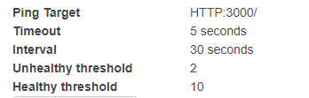

# Grupo 16 
>> Juan Pablo Osuna de Leon - 201503911

>> Guillermo Alfredo Peitzner Estrada - 201504468

# Herrmientas Utilizadas

>>AWS DynamoDB

>>AWS EC2

>>AWS AMI'S

>>AWS LOAD BALANCER

>>AWS APIGATEWAYS

>>AWS LAMBDA

>>AWS S3

# Usuarios IAM

>> usuario paoloman: 
>>> Permisos: 
    >>>> - AWSRekognitionFullAccess
    >>>> - AWSS3FullAccess

>> usuario dynamodb-semi1-key: 
>>> Permisos: 
    >>>> - AmazonDynamoDBFullAccess
    >>>> - AmazonRekognitionFullAccess

>> usuario memo: 
>>> Permisos: 
    >>>> - AmazonDynamoDBFullAccess

# Puertos Utilizados en Instancias  EC2

>> HTTP	TCP	80	0.0.0.0/0	-

>> HTTP	TCP	80	::/0	-

>> SSH	TCP	22	0.0.0.0/0	-

>> Custom TCP	TCP	3000	0.0.0.0/0	-

>> Custom TCP	TCP	3000	::/0

# Puertos Utilizados en Load Balancer

>> HTTP	3000	HTTP	3000	N/A	N/A

>> 

# Endpoints API Gateway

>> obtenerAsistencias

>>> https://v3jx6tlas9.execute-api.us-east-2.amazonaws.com/prod/obtenerasistencias

>> obtenerFotosGrupales

>>> https://v3jx6tlas9.execute-api.us-east-2.amazonaws.com/prod/obtenerfotosgrupales

>> registrarFotoGrupal

>>> https://v3jx6tlas9.execute-api.us-east-2.amazonaws.com/prod/registrarfotogrupal

# Buckets S3

>> pro1-sitio-web-grupo16

>>> http://pro1-sitio-web-grupo16.s3-website.us-east-2.amazonaws.com

>> pro1-images-grupo16

>>> http://pro1-images-grupo16.s3-website.us-east-2.amazonaws.com

